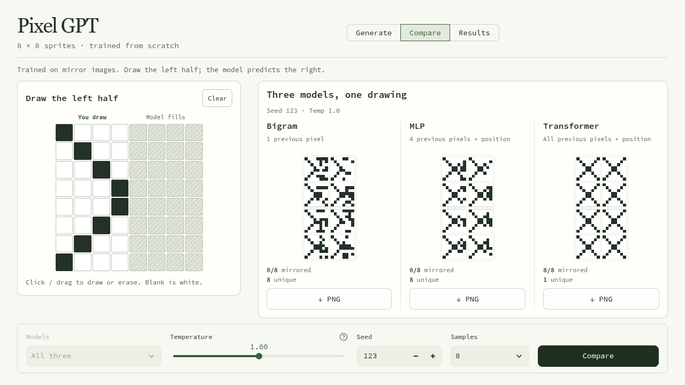

# Pixel GPT

Three small autoregressive models that generate 8×8 black-and-white sprites:
a bigram, an MLP, and a transformer. The idea is to see how much context each
model needs to learn symmetry.



## Run

Python 3.12. The requirements install CPU-only PyTorch on Linux and Windows.

```bash
python3 -m venv .venv
source .venv/bin/activate
python -m pip install -r requirements.txt
python -m streamlit run app.py
```

Open `http://localhost:8501`. The three trained checkpoints are included, so the
app works without training first.

To train all models again and update the evaluation:

```bash
python train.py
python evaluate.py
```

Training creates the dataset and saves the best validation checkpoint for each
model. It uses CUDA if a CUDA-enabled PyTorch build is installed, otherwise CPU.

To train or sample from just one model:

```bash
python train.py transformer --steps 1600 --lr 0.002
python sample.py transformer --count 16 --temperature 0.8
python sample.py transformer --prefix 0000000000100100
```

Sampling prints sprites in the terminal and saves `results/samples.svg`.
Temperature 0 picks the most likely pixel; higher values add randomness.
Retraining replaces that model's checkpoint and loss history. Run
`python evaluate.py` afterward to update the saved results.

## Drawing

Draw a pattern on the left half in **Generate**, or use **Compare** to try it
with all three models. Click or drag to paint dark pixels; start on a dark pixel
to erase. Untouched cells on the left stay white. The grey right half is reserved
for the model, and **Clear** resets your drawing.

Choose the settings below the canvas and press Generate or Compare. The sampler
moves left to right, row by row, keeping your left half and predicting the right.
The models learned from left–right mirror images, so a successful completion
mirrors your pattern. The app doesn't copy pixels across; each model predicts them.
Drawings and submitted settings carry across pages. Samples can be downloaded
as PNGs; **Results** shows the saved evaluation and learning curves.

## How it works

The dataset is 6,000 unique, horizontally symmetric sprites. A random left half
is mirrored to make each image, then split into 4,800 training, 600 validation,
and 600 test images. Dataset generation uses seed 42.

Each image becomes 64 binary tokens in row order. Token 2 is the start token:

```text
input:  START  0  1  1 ...
target:     0  1  1  0 ...
```

- `bigram.py` uses only the previous pixel, with a 3×2 table of scores.
- `mlp.py` uses the previous four tokens and position, with a 128-unit hidden layer.
- `transformer.py` uses the full preceding sequence, with two blocks, four attention
  heads, and 64-dimensional embeddings.

`data.py`, `train.py`, `sample.py`, and `evaluate.py` handle the shared parts.
All models are trained from scratch with next-pixel cross-entropy. Generation
does not mirror the output; symmetry has to come from the learned predictions.

## Results

One run with training seed 42. Evaluated on the held-out test set and 512 generated
sprites per model, with sampling seed 123 and temperature 1.

| Model | Parameters | Test loss | Mirrored pairs matching | Fully symmetric |
|---|---:|---:|---:|---:|
| Bigram | 6 | 0.6243 | 55.40% | 0 / 512 |
| MLP | 11,698 | 0.4169 | 81.25% | 0 / 512 |
| Transformer | 104,514 | 0.2776 | 99.99% | 511 / 512 |

The transformer can reach matching pixels earlier in the row. Its loss stays
above zero because the left half of each training image is random. These models
differ in capacity and position information as well as context length, so this
isn't an isolated test of context size.

Sample grids, loss histories, and full metrics are in [`results/`](results/).
The generated dataset is ignored by Git. The three small checkpoints are included
for the hosted demo.

## Hosting

On Streamlit Community Cloud, select `arnavp27/pixel-gpt`, branch `main`, entrypoint
`app.py`, and Python 3.12. No secrets or training step are needed. Set app sharing
to public so visitors can open the demo without signing in.

## Checks

```bash
python -m unittest test_models.py
```

Five checks cover the data split, shifted targets, causal masking, reproducible
sampling, and fixed pixels becoming context for later predictions.
