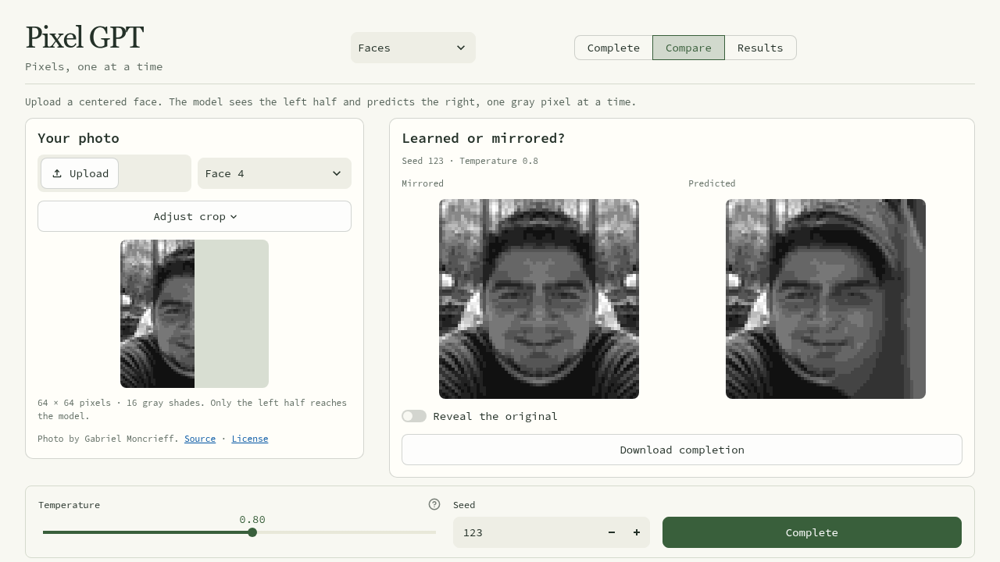
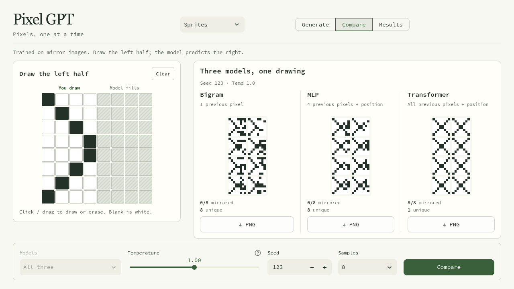

# Pixel GPT

[Try the app](https://pixel-gpt-arnav.streamlit.app/)

I built this while learning how autoregressive models work. I wanted something
small enough to understand, with an output I could actually see.

It started with 8×8 drawings: fill in the left half and let a model predict the
right. I trained a bigram, an MLP, and a small transformer in PyTorch to compare
what they learned from the same data.

I then added grayscale face completion. Both demos use next-pixel prediction, but
faces have shading, lighting, and features that don't match perfectly across
the middle.



## Sprites



1. Click or drag on the left half to draw dark pixels. Everything you leave blank
   stays white.
2. Start on a dark pixel to erase, or use Clear to start over. The grey right half
   is for the model.
3. Press Generate to complete the image, or Compare to try all three models with
   the same drawing.

Your left half stays fixed in every sample. The models predict the right half
from the pixels before it; the app doesn't copy your drawing across.

Temperature controls randomness. At 0, the model always picks its most likely
pixel. Higher values make it more willing to try less likely pixels. The seed
lets you repeat a result with the same model, drawing, and settings.

The drawing carries between Generate and Compare. You can download the samples
as PNGs. Results shows the saved training curves and model comparison.

## What the models learned

The dataset has 6,000 unique images. Each one starts with a random 8×4 left half,
which is mirrored to make the right half. The split is 4,800 training images,
600 validation images, and 600 test images, using seed 42.

This teaches left-right symmetry. There's no top-bottom symmetry rule in the
data, which is why the canvas lets you draw only on the left.

Each image becomes a sequence of 64 pixels, read left to right, row by row.
White is 0, dark is 1, and 2 is the start token. During training, the input is
shifted by one position:

```text
input:  START  0  1  1 ...
target:     0  1  1  0 ...
```

The loss is cross-entropy between each prediction and the actual next pixel in
the training image, averaged over all pixels in the batch. A prediction gets
lower loss when it gives the target pixel a higher probability.

- `sprites/bigram.py` only sees the previous pixel. It's a 3×2 table of scores.
- `sprites/mlp.py` sees four previous pixels and the position, with a 128-unit hidden layer.
- `sprites/transformer.py` sees all previous pixels and their positions. It has two
  transformer blocks, four attention heads, and 64-dimensional embeddings.

All three are trained from scratch. Their weights stay fixed when you use the
app; drawing on the canvas doesn't train them again.

## Sprite results

These are from one run with training seed 42. Test loss uses the 600 held-out
images. The symmetry scores use 512 images generated by each model without a
user drawing, at temperature 1 and sampling seed 123.

| Model | Parameters | Test loss | Mirrored pairs matching | Fully symmetric |
|---|---:|---:|---:|---:|
| Bigram | 6 | 0.6243 | 55.40% | 0 / 512 |
| MLP | 11,698 | 0.4169 | 81.25% | 0 / 512 |
| Transformer | 104,514 | 0.2776 | 99.99% | 511 / 512 |

The transformer learned to match pixels across a row much more reliably. Its
test loss stays above zero because the left half of each training image is random.
The models also differ in size and position information, so context length isn't
the only difference in this comparison.

In the drawing demo, the transformer often repeats the same completion across
samples. That makes sense here: a fixed left half has only one exact mirror
image. The model can still make mistakes, especially at higher temperatures.

Sample grids, loss histories, and the full metrics are in [`results/sprites/`](results/sprites/).

## Faces

The face model takes a 64×64 image with 16 gray shades. It receives the 2,048
pixels in the left half before predicting the 2,048 pixels in the right half:

```text
START → left half, row by row → right half, row by row
```

There are 17 input tokens: 0 is black, 15 is white, the values between them are
gray shades, and 16 is the start token. The model predicts one of the 16 shades.
During training, cross-entropy scores only the right half.
The target is the actual missing half of a training photo.

It's a separate transformer with six blocks, four attention heads, and
256-dimensional embeddings. The training data is FFHQ, split into 60,000
training faces, 5,000 validation faces, and 5,000 test faces. Preprocessing and
image credits are described in [faces/DATA.md](faces/DATA.md).

The app has an upload and crop workflow, a mirror comparison, and a way to
reveal the original photo. Generation uses only the left half; the original
right half is kept for comparison. This model is for centered faces, not general
image completion. At 64×64, the output still looks pixelated, but has more
detail than the first 32×32 version.

Choose Faces in the app, upload a photo or pick an example, and adjust the crop
if needed. Press Complete to generate the missing half. Compare shows the
model beside a mirrored version; Reveal the original lets you check both.

I trained the 5,796,112-parameter model from scratch for 12,000 steps using
AdamW, an effective batch of 32, and a cosine learning-rate schedule. It took
about 2 hours 20 minutes on my RTX 4050 laptop GPU. Checkpoint selection uses
the same 512 validation faces at each check. Final loss is measured on all
5,000 test faces; generated completions are also compared with simply
mirroring the left half.

| Measure | Result |
|---|---:|
| Right-half test loss | 0.7797 |
| Model pixel error | 0.1911 |
| Mirror pixel error | 0.2027 |

Pixel error is mean absolute error on the missing half, with shades scaled to
0–1. These two errors use 128 randomly selected test faces, temperature 0.8,
and sampling seed 123. Lower is better. The model had lower average error on
this sample, but it can still miss features or produce odd backgrounds. This
isn't a way to recover the exact hidden photo.

The saved [comparison grid](results/faces/comparison.png) shows the first eight
of those test samples. Metrics, the training settings, curves, and image
credits are in [results/faces/](results/faces/). Sampling uses a KV cache so it
doesn't recompute the whole prefix for each new pixel.

## Code

```text
app.py              Streamlit entry point
ui/                 Sprite and face pages
sprites/            The original three models, training, and sampling
faces/              Face data, preprocessing, transformer, training, and sampling
checkpoints/        Weights loaded by the app, grouped by demo
results/            Saved metrics, loss curves, and sample images
```

Training data and intermediate checkpoints stay out of Git. The app loads the
selected weights and runs generation; training happens separately.
